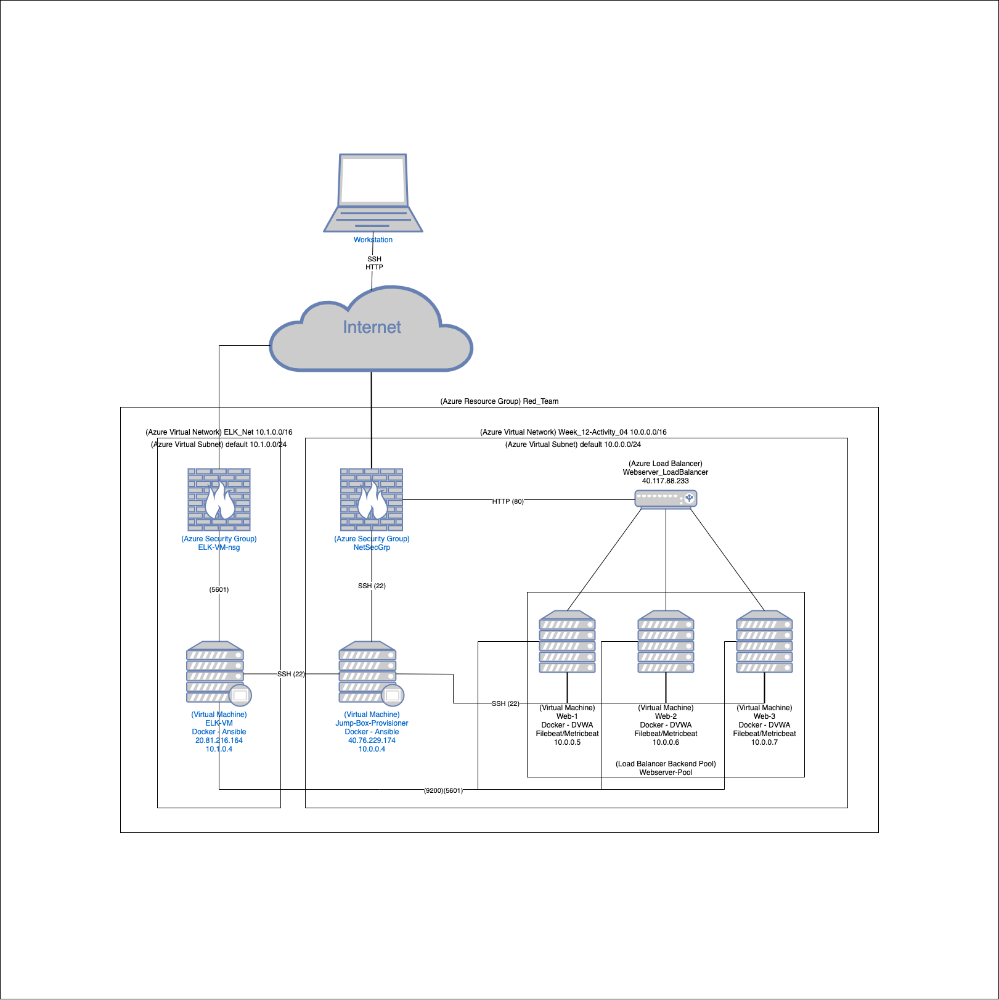

## Azure-NetSec-Project
Network diagram and Ansible scripts from cybersecurity class project

### Background

This repository contains a diagram of a deployed virtual network as well as the ansible playbooks used to configure it.  

The files here are from a project I completed for a cybersecurity class. It pulled together concepts from previous sessions on Cloud computing, network security, logging and monitoring. I spun up several virtual machines to simulate a network secured behind a virtual network security group and monitored through a cloud monitoring system. I created [Ansible playbooks](ansible) to configure the servers, and logs are collected and forwarded to an ELK stack using Filebeat and Metricbeat.

### The Network

**Virtual Machines**

- A jumpbox running a docker container used to configure the rest of the virtual web servers and ELK stack. 
- 3 machines, each running filebeat and metricbeat for logs and a dockerized DVWA (Damn Vulnerable Web Application). 
- 1 machine configured to run an ELK stack for the network monitoring system

**Network**

- Two Virtual Network Security Groups each running a virtual network
    - 1 network on 10.1.0.0/16
        - ELK stack
    - 1 network on 10.0.0.0/16
        - 3 DVWA machines
- A loadbalancer to provide redundancy and failover support

**Security** 

- Access to servers only allowed via SSH with a key
- Access further limited to specific IP addresses

### Network Diagram

